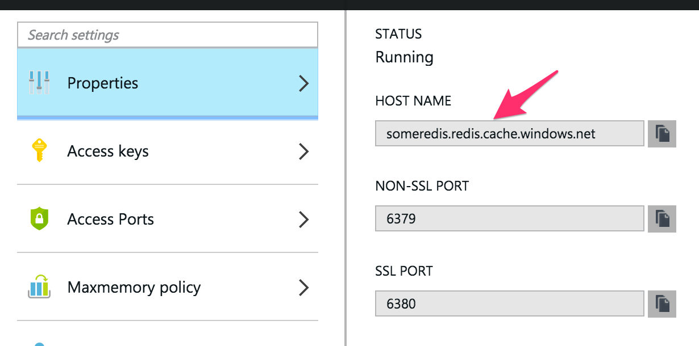
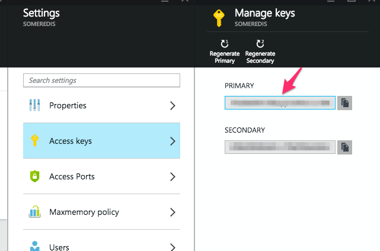
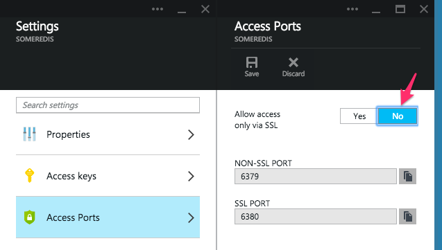

# Getting Started with Azure Redis Cache

## Objectives

By the end of this module you will:

- Learn about Azure Redis Cache
- Learn how to create a new cache in the Azure portal. 
- Learn how to connect to your instance using the CLI.

## Azure Redis Cache

Microsoft Azure Redis Cache is based on the popular open source Redis Cache. It gives you access to a secure, dedicated Redis cache, managed by Azure. Any updates or patches to Redis are fully managed by Azure. A cache created using Azure Redis Cache is accessible from any application.

Microsoft Azure Redis Cache is available in two tiers:
* Basic – Single node. Multiple sizes.
* Standard – Two-node Master/Slave. Includes SLA and replication support. Multiple Sizes.

The cache is available in sizes up to 53 GB.

Azure Redis Cache leverages Redis authentication and supports SSL connections to Redis.

## Creating a New Cache

1. Sign into [Azure](https://azure.com)
2. Navigate to the [Preview Portal](https://portal.azure.com)


3. Click the New button on the left bottom corner. 


4. Select the Data+Storage option in the Create blade and then select the Redis Cache option in the Data + Storage blade. 


5. Name your new Redis Cache and select the size in the Pricing Tier option. Press create at the bottom when satisfied. 


6. Go to the Startboard and wait for the new Redis Cache to be created. 


## Connecting to your Instance with Redis CLI

### Obtaining Your Connection Information

Click on the the newly created Redis Cache tile and select **'All Settings'**, then select **Properties**:



Save the hostname somewhere we'll need that in a second. Back on the Settings blade click **Access Keys** option and copy the **Primary** key:



Finally, we'll disable SSL which is turned on by default. Redis clients may or may not support SSL. For example, the Node.js client doesn't support SSL out of the box but [this fork](https://github.com/paddybyers/node_redis) provides an implementation. The [Python Redis client](https://github.com/andymccurdy/redis-py/) has support for SSL.

For the purposes of this tutorial series, we'll turn SSL off:



### Connecting to the Redis server

To connect to the Azure Redis instance, you can execute this command:

```bash
$ redis-cli -h <redis-cache-name>.redis.cache.windows.net -p 6379 -a <your key>
```

This command creates a connection to your Azure Redis instance. You can execute any of the commands that you could do against a local Redis instance.

```bash
someredis.redis.cache.windows.net:6379> GET somekey
(nil)
someredis.redis.cache.windows.net:6379> SET somekey 'some value'
OK
someredis.redis.cache.windows.net:6379> GET somekey
"some value"
```                                                             