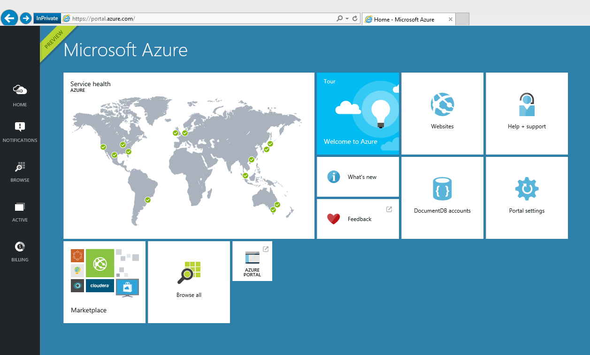
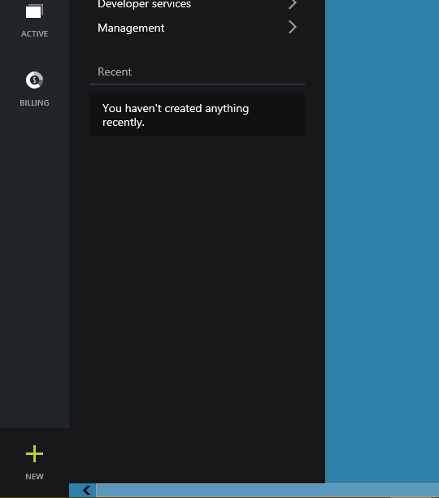
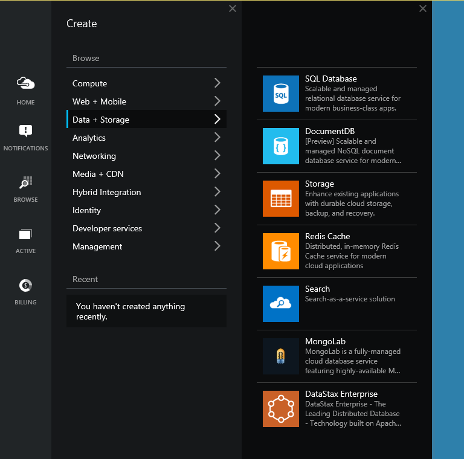
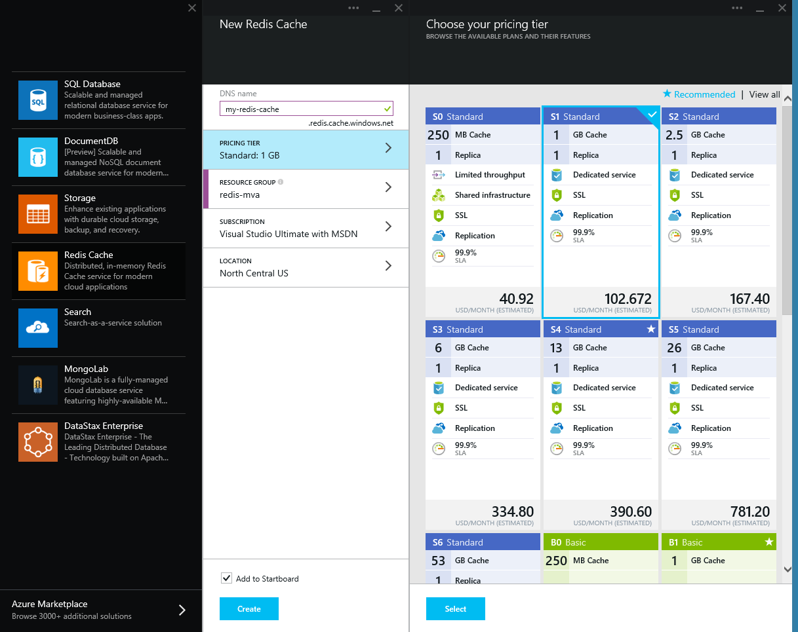
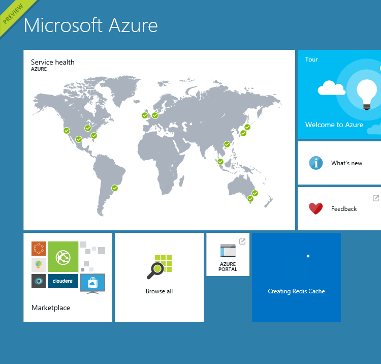

# Getting Started with Azure Redis Cache

## Objectives

By the end of this module you will know how to:

- Learn about Azure Redis Cache
- Learn how to create a new cache in the azure portal. 
- Learn how to connect to your instance using the CLI.

## Azure Redis Cache

Microsoft Azure Redis Cache is based on the popular open source Redis Cache. It gives you access to a secure, dedicated Redis cache, managed by Microsoft. A cache created using Azure Redis Cache is accessible from any application within Microsoft Azure.

Microsoft Azure Redis Cache will be available in two tiers:
* Basic – Single node. Multiple sizes.
* Standard – Two-node Master/Slave. Includes SLA and replication support. Multiple Sizes.

Cache is available in sizes up to 53 GB.

Azure Redis Cache leverages Redis authentication and also supports SSL connections to Redis.

## Creating a New Cache

1. Sign into Azure
2. Navigate to the [Preview Portal](https://portal.azure.com)

3. Press the New button on the left bottom corner. 

4. Select the Data+Storage option in the Create blade and then select the Redis Cache option in the Data + Storage blade. 

5. Name your New Redis Cache and select the size in the Pricing Tier option. Press create at the bottom when satisfied. 

6. Go to the Startboard and wait for the new Redis Cache to be created. 

## Connecting to your Instance with Redis CLI

TODO: Finish here.
