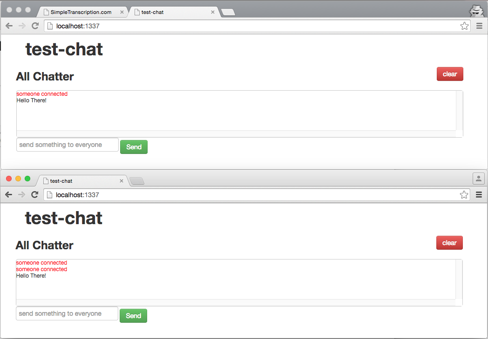
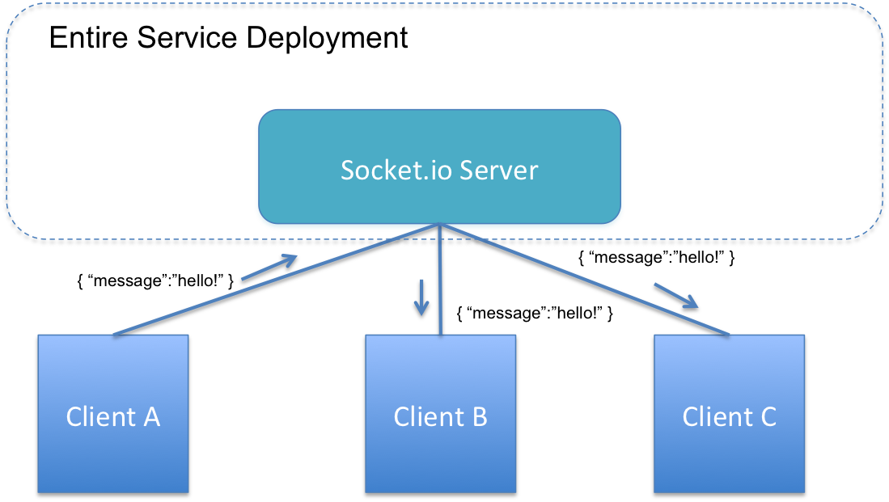
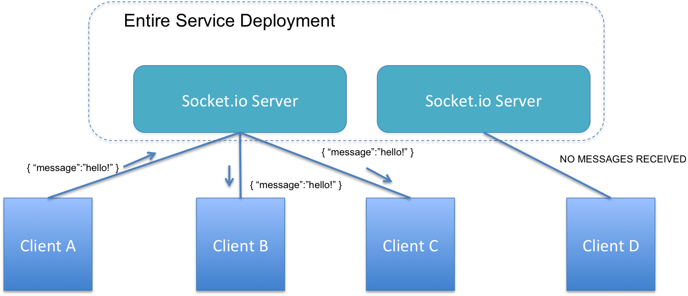
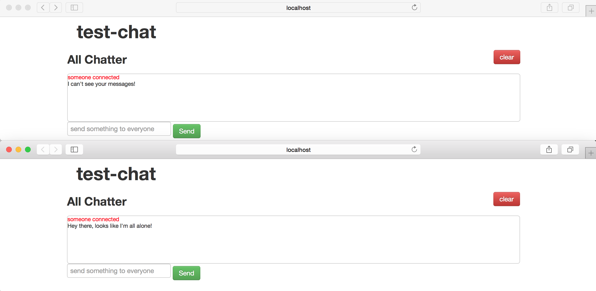
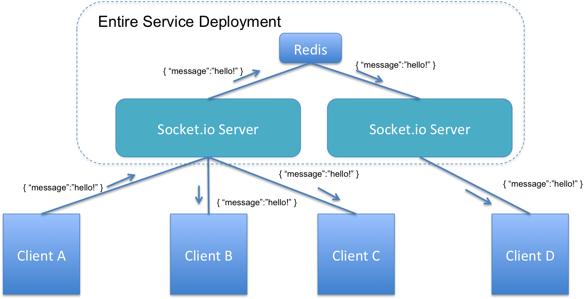
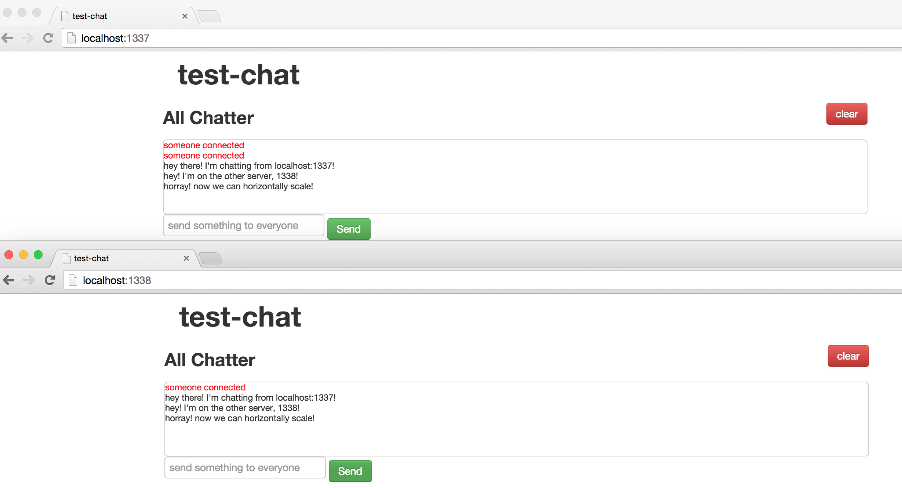
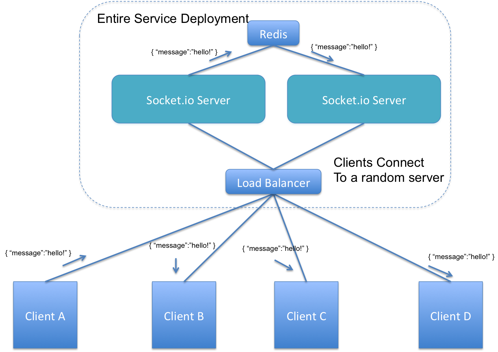

# Redis Publish-Subscribe

## Objectives

By the end of this module you will:

- Learn about publish-subscribe
- Learn about how to setup Redis for pub/sub
- How to consume and produce messages with Node.js
- How to Scale a Messaging Application with Redis

## Redis Publish-Subscribe

Publish-subscribe or pub/sub for short is a messaging pattern where there are multiple publishers sending messages to multiple subscribers listening for messages on specific channels through server software. It is one of the most common message queue patterns. Many systems have been created for this purpose among them Redis, RabbitMQ, Azure MessageBus and more... 

Redis, a high-performance data structure store, has added support for pub/sub on top of its existing functionality. Redis pub/sub is built on three commands: `PUBLISH`, `SUBSCRIBE` and `UNSUBSCRIBE`. 

The `SUBSCRIBE` command lets a client subscribe to the channels passed to the command start receiving messages e.g. `SUBSCRIBE analytics` will subscribe the client to the analytics channel. 

The `UNSUBSCRIBE` command will unsubscribe the client from the specific channels.

All messages received take the form of a three-element array. The first element is the kind of message: "subscribe", "unsubscribe" and "message". The "subscribe" message indicates if the client was successful in subscribing with the "unsubscribe" message indicating the opposite. The "message" message contains the payload sent to the channel with the `PUBLISH` command. 

Redis developers suggest for you to create separate clients for publishers and subscribers.

Redis Client #1:
```
> SUBSCRIBE analytics
Reading messages... (press Ctrl-C to quit)
1) "subscribe"
2) "analytics"
3) (integer) 1
```

Redis Client #2:
```
> PUBLISH analytics visit_page
(integer) 1
```

Redis Client #1:
```
1) "message"
2) "analytics"
3) "visit_page"
```

Redis pub/sub also has support for pattern matching when subscribing in clients. The `PSUBSCRIBE` command takes glob-style patterns. For example, if you wanted to subscribe to all messages on the "news." channel, you can use `PSUBSCRIBE news.*`. If you want to be more specific and only want to subscribe to art news, you can use `PSUBSCRIBE news.art`.

## Using Redis Publish-Subscribe with Node.js

To use the Redis pub/sub mechanism with Node.js, the first thing you will want to do is select a native Redis client. The preferred Node client is the [node_redis](https://github.com/mranney/node_redis) package.

The first thing you want to do is run `npm install redis` to install the node package into your project. 

Second, you want to require the node_redis project and create a Client for both the publisher and subscriber. Note, we are using the default client settings here. 

```js

var redis = require("redis");

var pub = redis.createClient();
var sub = redis.createClient();
```

Next, you want to set event handlers to the client to handle receiving messages and subscribe to the right channel.

```js

sub.on("subscribe", function(channel, count) {
	console.log("Subscribed to " + channel + ". Now subscribed to " + count + " channel(s).");
});

sub.on("message", function(channel, message) {
	console.log("Message from channel " + channel + ": " + message);
});

sub.subscribe("analytics");
```

Next, you want to set up the publisher to send messages on the channel.

```js
pub.publish("analytics", "page_viewed");
```

That's all you need to use Redis pub/sub!

# Scaling a Real-time Messaging Application with Pub/Sub

By itself it may be unclear why Redis' Pub/Sub feature is useful. However we can explain why this is so useful for scalability with a simple chat application. We'll be using Socket.IO and Node.js to do this application example but the architectural principal transcends languages.

We won't be going into much of the application details but if you want to learn more about the inner workings of Socket.IO and Node Express, check out one of our [previous MVAs](https://github.com/sayar/NodeMVA/tree/master/09_NodeChatroom).

## Creating the Application

First let's quickly build a chat application using the [Yeoman generator](http://yeoman.io). Yeoman allows us to quickly scaffold an app using a variety of technologies that work together. 

Execute these commands:

```bash
npm install yo -g
npm npm install -g generator-socketio
yo socketio
# Answer all the questions Yeoman asks (we will call our app test-chat)
# Npm May fail to install (you may need to run it with sudo). If so execute:
npm install
npm install bower -g
bower install
```
Now run the application by executing:

```bash
# install grunt cli
npm install -g grunt-cli
# star the app
grunt
```

Alright and if everything went well for you, your default web browser should have launched with the live chat app where you can send a message:



You'll notice the debug output when you send a message:


```bash
debug - websocket writing 5:::{"name":"blast","args":[{"msg":"<span style=\"color:red !important\">someone connected</span>"}]}
   info  - unhandled socket.io url
   info  - unhandled socket.io url
{ msg: 'test message' }
   debug - websocket writing 5:::{"name":"blast","args":[{"msg":"test message"}]}
   debug - sending data ack packet
   debug - websocket writing 6:::1
   info  - unhandled socket.io url
   info  - unhandled socket.io url

```

## Scaling the Application

### The Problem

Notice that multiple clients can chat with each other when they connect to the same server. This is a high-level look at the application messaging architecture:



A client sends a message to everyone else connected to the server by dispatching a message to the server. Then the server broadcasts it to its connected clients.

Running locally we have 1 server, however when you roll out a service, you want more than just 1 instance of the server running. Say we add another Socket.IO server to scale the chat service:



Now, the way things are, Client D would never get any messages from clients A B 
or C. 

### Creating the Messaging Application

We can try this out for real by just copying the application we made to another directory:

```bash
# copy the application directory to another
$ cp -R test-chat test-chat2
```

Now change the port you run the application by modifying the top couple lines in the `Grunt.js` file generated to run on port `35728` and `1338`:

`Grunt.js`:

```js
var LIVERELOAD_PORT = 35728;
var RUNNING_PORT = 1338; // <- if you change this, you need to change in public/js/app.js and recompile
```

Next, in `public/js/app.js` modify this first line of code to tell the browser to connect to the new port number we just set:

`public/js/app.js`:

```js
// connect to our socket server
var socket = io.connect('http://127.0.0.1:1338/');
```

Notice, how we can't send a message from one window to the other:



#### Scaling With Redis

A great way to solve this is by using Redis' pub/sub feature to facilitate messages between our Socket.IO servers. With this here's how our architecture looks:



In this scenario, client D can now receive a message from client A because the backend servers are connected with Redis.

Let's actually implement this. Luckily the nice folks at Socket.IO has already created a [Socket.IO Redis adapter](http://npmjs.com/package/socket.io-redis) just for this use.

In our case we need to make the following changes for **each** version of the application. In the real-world deployment we wouldn't have to do this because we would have a load balancer in place.

First, we have to install the Redis adapter and update the Socket.IO package. Execute this command to install the adapter:

```bash
npm install socket.io-redis --save
```

As of writing this the Yeoman Socket.IO generator uses an outdated version of the package. Change your `package.json` dependencies to look like this:

```json
"dependencies": {
    "ejs": "~0.8.5",
    "express": "~3.4.6",
    "express-device": "~0.3.7",
    "socket.io": "~1.3.5",
    "socket.io-redis": "^0.1.4"
  }
```

Now we need to tell the Node.js servers to use Redis.  Change `server.js` first few `require` statements to use the Redis adapter:

`server.js`

```js
var server = require('http').createServer(app);
var io = require('socket.io')(server);
var redis = require('socket.io-redis');
io.adapter(redis({ host: 'localhost', port: 6379 }));
```

Remember all these changes need to be made to **both** versions of your app to make this demo work.

Now run both applications by using two terminal windows and executing `grunt`. Navigate one browser to `http://localhost:1338` and the other to `http://localhost:1337`.

Notice now, we can send messages between the windows, even though they are both connected to two different Socket.IO servers:



Redis allows us to horizontally scale our service allowing multiple servers to publish and subscribe to messages so that users connected to different instances of the app can communicate.

We won't actually do this in our walkthrough but when you deploy to [Azure](http://azure.com) or any other cloud service your final architecture would have a load balancer, which logically would look like a single server to your clients. Azure abstracts the load balancer from you and makes it easy to setup load balancing without having to do any low-level web server configuration.

Here's what this architecture would look like in an actual cloud deployment:


